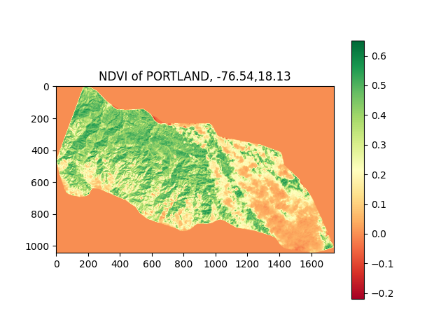
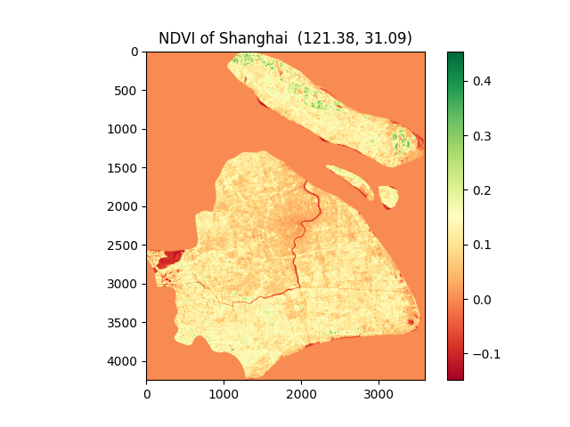
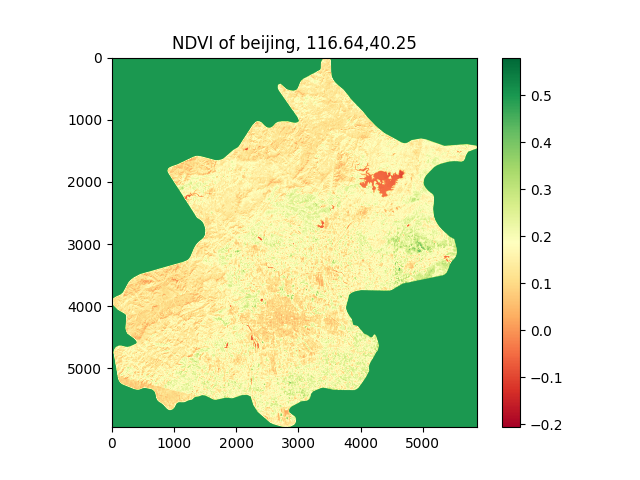

# Earth Observation : How green is your city?
#### [View My Video on YouTube](https://www.youtube.com/watch?v=9LhqhBOE6vc)
#### Description:

- Earth observation is also called Remote Sensing(RS in short), so that people can see, hear, sense and feel from space. Different from human being, a sensor can also see more distance and areas than humans. It can also capture something that human being's eyes cannot see! 
+ This project can observe earth through vegitation cover indexes, e.g NDVI(Normalized Difference Vegetation Index), to compare the cities or areas around the world! You can input your city's name like Beijing, New York, etc., and you can download images from Landsat 8 or other Landsat series. After merging many raster images and cropping images according to the area of your interest, then you can calculate the greenery or vegetation index. Finally, you can draw pictures of the citry or area of interest to see how green is it. And you can also compare different cities' greenery with their NDVI pictures.
+ This software can help researchers to download data automaticaly on Landsat SERRIES and pre-process those downloaded raster image data. For example, they can analyze urbanization in quantity, for viewing the ground from sky can get more data than that collecting by human on ground.
* The Vegetation Health index (VHI) is based on a combination of products extracted from vegetation signals, namely the Normalized Difference Vegetation Index (NDVI) and from the brightness temperatures, both derived from the NOAA (National Oceanic and Atmospheric Administration).
### Code Structure
- The following is the design of functions in the software with Python:

    - (1) main(): call other functions and get some parameters input by users.
    - (2) DownloadData(): this function shows you how to automatically download the bulk images data with low Cloud Covered from Landsat-8 or other series only need raw Python!<br>
      - Firstly, it needs the name of a city that the user wants to download images, then the software can read shapefile of the city, which is a kind of file format that has become an open standard in GIS (geographic information system). 
      - Secondly, it needs times ( begin and end times) in LANDSAT data, the cloud cover degree (0-100).<br>
    - (3) data_processing(): it will call get_band() function, which will crop and merge your images for further calculating NDVI.
    - (4) NDVI(Normalized difference vegtation index) Calculation function:
        - The calculating equation is as follows:
        $NDVI=\frac{\rho_{NIR}-\rho_{red}}{\rho_{NIR}+\rho_{red}}$
        - NDVI values range from -1 to 1.
        - The bigger is NDVI, the more green is your city.
    - (5) get_bands_plot(): plot the city or area of interest with NDVI color as a map picture which can be saved to your disk.   <br>
     <br>
      <br>
    - (6) plot_Area_of_interest(): it can generate html files and see your city' shape with rows and paths in LANDSAT on a digital map. <br><br>

- Other functions:
  - get_city_name(): if the input city name in the database, return True.
  - get_date(): if the input date is correct format, return True.
  - get_band(): merge band images and crop the result according to the shape of your city; called by data_processing().
  - get_boundary(): return the shape information (points and their coordinates) of your city; called by get_bands_plot().


#### References
1.http://geologyandpython.com/get-landsat-8.html <br>
2.A five-year analysis of MODIS NDVI and NDWI for grassland
drought assessment over the central Great Plains of the United States
```
@article{Gu2007AFA,
  title={A five‐year analysis of MODIS NDVI and NDWI for grassland drought assessment over the central Great Plains of the United States},
  author={Yingxin Gu and Jesslyn F. Brown and James P. Verdin and Brian D. Wardlow},
  journal={Geophysical Research Letters},
  year={2007},
  volume={34}
}
```
3.A book: Remote Sensing, theorie en toepassingen van landobservatie <br>
4.https://pro.arcgis.com/zh-cn/pro-app/latest/help/analysis/raster-functions/band-arithmetic-function.htm <br>
5.https://landsat.gsfc.nasa.gov/about/the-worldwide-reference-system/#:~:text=The%20Worldwide%20Reference%20System%20(WRS,by%20PATH%20and%20ROW%20numbers)

### Terms Attention
（1) Landsat
（2）Remote Sensing
（3）Earth Observation
（4）GIS
（5）GeoPandas
（6）Shape
（7）NDVI
（8）folium
 
