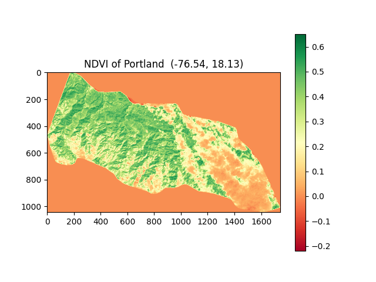
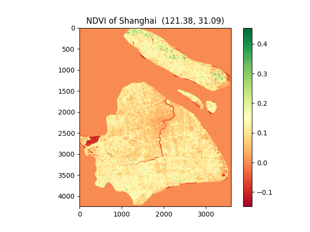
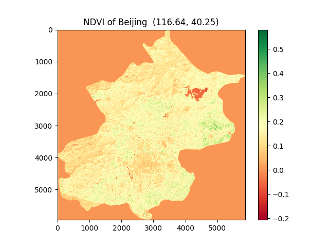

# Earth Observation : How green is your city?
#### [View My Video on YouTube](https://youtu.be/avB4XzX5Cos)
#### Description:

- Earth observation is also called Remote Sensing(RS in short), so that people can see, hear, sense and feel from space. Different from human being, a sensor can also see more distance and areas than humans. It can also capture something that human being's eyes cannot see! 
+ This project can observe earth through vegitation cover indexes, e.g. NDVI(Normalized Difference Vegetation Index), to compare the cities or areas around the world! You can input your city's name like Beijing, New York, etc., and you can download images from Landsat 8 or other Landsat series. After merging many raster images and cropping images according to the area of your interest, then you can calculate the greenery or vegetation index. Finally, you can draw pictures of the citry or area of interest to see how green is it. And you can also compare different cities' greenery with their NDVI pictures.
+ This software can help researchers to download data automaticaly on Landsat SERRIES and pre-process those downloaded raster image data. For example, they can analyze urbanization in quantity, for viewing the ground from sky can get more data than that collecting by human on ground.
* The Vegetation Health index (VHI) is based on a combination of products extracted from vegetation signals, namely the Normalized Difference Vegetation Index (NDVI) and from the brightness temperatures, both derived from the NOAA (National Oceanic and Atmospheric Administration).
### Code Structure
- The following is the design of functions in the software with Python:

    - (1) main(): call other functions and get some parameters input by users.
    - (2) DownloadData(): this function shows you how to automatically download the bulk images data with low Cloud Covered from Landsat-8 or other series only need raw Python!<br>
      - Firstly, it needs the name of a city that the user wants to download images, then the software can read shapefile of the city, which is a kind of file format that has become an open standard in GIS (geographic information system). 
      - Secondly, it needs times ( begin and end times) in LANDSAT data, the cloud cover degree (0-100).<br>
    - (3) data_processing(): it will call get_band() function, which will crop and merge your images for further calculating NDVI.
    - (4) NDVI(Normalized difference vegtation index) Calculation function:
        - The calculating equation is as follows:
        $NDVI=\frac{\rho_{NIR}-\rho_{red}}{\rho_{NIR}+\rho_{red}}$
        - NDVI values range from -1 to 1.
        - The bigger is NDVI, the more green is your city.
    - (5) get_bands_plot(): plot the city or area of interest with NDVI color as a map picture which can be saved to your disk.  
    
    - 2.  
    - 3.  
    - (6) plot_Area_of_interest(): it can generate html files and see your city' shape with rows and paths in LANDSAT on a digital map. <br><br>

- Other functions:
  - get_city_name(): if the input city name in the database, return True.
  - get_date(): if the input date is correct format, return True.
  - get_band(): merge band images and crop the result according to the shape of your city; called by data_processing().
  - get_boundary(): return the shape information (points and their coordinates) of your city; called by get_bands_plot().


#### References
1.http://geologyandpython.com/get-landsat-8.html <br>
2.A five-year analysis of MODIS NDVI and NDWI for grassland
drought assessment over the central Great Plains of the United States
```
@article{Gu2007AFA,
  title={A five‐year analysis of MODIS NDVI and NDWI for grassland drought assessment over the central Great Plains of the United States},
  author={Yingxin Gu and Jesslyn F. Brown and James P. Verdin and Brian D. Wardlow},
  journal={Geophysical Research Letters},
  year={2007},
  volume={34}
}
```
3.A book: Remote Sensing, theorie en toepassingen van landobservatie <br>
4.https://pro.arcgis.com/zh-cn/pro-app/latest/help/analysis/raster-functions/band-arithmetic-function.htm <br>
5.https://landsat.gsfc.nasa.gov/about/the-worldwide-reference-system/#:~:text=The%20Worldwide%20Reference%20System%20(WRS,by%20PATH%20and%20ROW%20numbers)

### Terms Attention
（1）<b>Landsat</b>: The Landsat Program is a series of Earth-observing satellite missions jointly managed by NASA and the U.S. Geological Survey. Landsat satellites have the optimal ground resolution and spectral bands to efficiently track land use and to document land change due to climate change, urbanization, drought, wildfire, biomass changes (carbon assessments), and a host of other natural and human-caused changes. The Landsat Program’s continuous archive (1972-present) provides essential land change data and trending information not otherwise available. Landsat represents the world’s longest continuously acquired collection of space-based moderate-resolution land remote sensing data. <br>
（2）<b>Remote Sensing</b>: Remote sensing (also called earth observation or teledetection) meets the
strong need nowadays for information about the changing world, for observing earth surface features and monitoring the processes concerning them. <br>
（3）<b>Earth Observation</b>: Earth Observation is also called Remote Sensing(RS). <br>
（4）<b>GIS</b>: A spatial system that creates, manages, analyzes, and maps all types of data. GIS connects data to a map, integrating location data (where things are) with all types of descriptive information (what things are like there). This provides a foundation for mapping and analysis that is used in science and almost every industry. GIS helps users understand patterns, relationships, and geographic context. The benefits include improved communication and efficiency as well as better management and decision making. <br>
（5）<b>GeoPandas</b>: GeoPandas is an open source project to make working with geospatial data in python easier. GeoPandas extends the datatypes used by pandas to allow spatial operations on geometric types. Geometric operations are performed by shapely. <br>
（6）<b>Shape</b>: Shape is an important aspect of spatial attributes of land use segments in remotely sensed imagery. <br>
（7）<b>NDVI</b>：The full name is called Normalized Difference Vegetation Index, which quantifies vegetation by measuring the difference between near-infrared (which vegetation strongly reflects) and red light (which vegetation absorbs). NDVI always ranges from -1 to +1, ut there isn’t a distinct boundary for each type of land cover.
For example, when you have negative values, it’s highly likely that it’s water. On the other hand, if you have an NDVI value close to +1, there’s a high possibility that it’s dense green leaves. But when NDVI is close to zero, there are likely no green leaves and it could even be an urbanized area. NDVI is the most common index that analysts use in remote sensing. <br>
（8）<b>Folium</b>: The Folium library in Python helps us analyze the location and geospatial data with ease and lets us create interactive maps.Folium is a Python library used for visualizing geospatial data. It is easy to use and yet a powerful library. Folium is a Python wrapper for Leaflet.js which is a leading open-source JavaScript library for plotting interactive maps.
